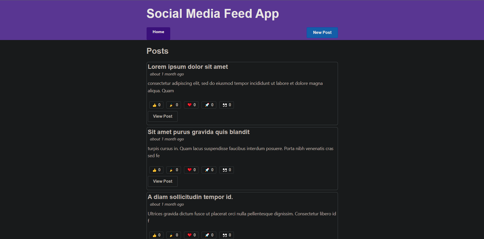

# React Redux Social Media Feed

This app is a simplified social media feed app with some real-world features. 
It allows users to create and edit their own posts as well as to view posts created by other users. 
By clicking on a post the user can view its content in its entirety. 
As is the case with most social media apps, the user is also given the ability to react to other people's posts with reaction emojis by using a row of emoji reaction buttons at the bottom of each post. 
This app was developed with ReactJS with the main purpose of putting into practice the main concepts of Redux such as creating state slices, slice reducers and actions and writing async logic with thunks but it also involved the development of a backend server with Node.js, Express and the MongoDB database(MERN stack) for storing the posts data.

This web app was built with:
* ReactJS
* React Hooks
* Redux
* JS Fetch API
* NodeJS
* Express
* MongoDB

Click <a href="https://safe-peak-04467.herokuapp.com/" target="_blank">here</a> to try out the app for yourself.
